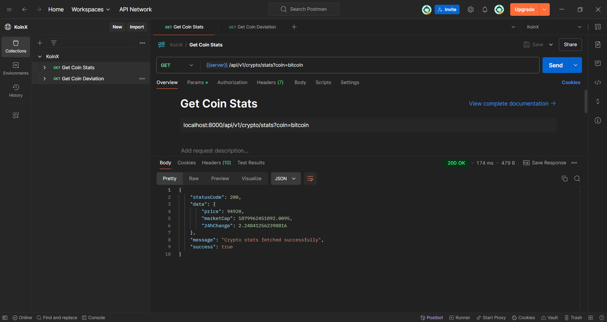

# KoinX_Assignment
## Cryptocurrency Tracker with Node.js and MongoDB

This project is a server-side application built with **Node.js** and **MongoDB** to track cryptocurrency data (Bitcoin, Matic, Ethereum). The application fetches real-time data using the CoinGecko API, schedules background jobs to update the data, and provides APIs for retrieving statistics and calculating price deviations.

---

## **Features**

1. **Background Job**:
   - Fetches real-time cryptocurrency data (price, market cap, 24h change) every day at midnight using `node-schedule` to ensure the free API calls don't get exhausted.
   - Stores the fetched data in a MongoDB database.

2. **APIs**:
   - **`/stats`**: Fetch the latest cryptocurrency data.
   - **`/deviation`**: Calculate the standard deviation of cryptocurrency prices over the last 100 records.

3. **Environment Configuration**:
   - Uses environment variables for storing API configuration details.

4. **Error and Response Handling**:
   - Custom error and response classes for consistent and structured responses.

5. **Deployment**:
   - Deployable to platforms like Heroku, AWS, or any cloud platform.
   - MongoDB Atlas integration for the database.

---

## **Technologies Used**

- **Node.js**: Backend runtime environment.
- **Express.js**: Web framework for building APIs.
- **MongoDB**: Database for storing cryptocurrency data.
- **Axios**: HTTP client for fetching data from the CoinGecko API.
- **Mongoose**: MongoDB ORM for schema design and queries.
- **node-schedule**: Scheduler for running background jobs.
- **dotenv**: Environment variable management.

---
## **Installation and Setup**

### **Prerequisites**
- [Node.js](https://nodejs.org/) (v14 or higher)
- [MongoDB](https://www.mongodb.com/) (local or Atlas)
- [Git](https://git-scm.com/)

### **Steps**
1. Clone the repository:
   ```bash
   git clone https://github.com/tusharjain24/KoinX_Assignment.git
   cd KoinX_Assignment
   ```
2. Install Dependencies:
    ```bash
    npm install
    ```
3. Run the server:
    ```bash
    npm run dev
    ```

## Environment Variables

To run this project, you will need to add the following environment variables to your .env file

`MONGODB_URI`
`COINGECKO_API_BASE`
`COINGECKO_COINS`
`COINGECKO_PARAMS`
`include_24hr_change`

## Preview of APIs

Postman API Screenshot: Get Coin Stats


- [Click here to view Postman's API collection Documentation](https://www.postman.com/lms999-9748/koinx/documentation/yenta2z/koinx)
- Make sure to select `KoinX` environment in the collection Documentation.
- [Link to the Collection](https://www.postman.com/lms999-9748/koinx/collection/yenta2z/koinx?action=share&source=copy-link&creator=0&active-environment=4b2a62dd-45ed-4462-bbc2-41e57f25bde6)
 

## API Reference

### 1. Health Check API

- **Endpoint**: `/api/v1/healthcheck`
- **Method**: `GET`
- **Description**: Checks the health of the server.
- **Response**:
  - **Status Code**: `200 OK`
  - **Body**:
    ```json
    {
      "statusCode": 200,
      "data": null,
      "message": "Health Check Passed",
      "success": true
    }
    ```

### 2. Get Cryptocurrency Stats

- **Endpoint**: `/api/v1/crypto/stats`
- **Method**: `GET`
- **Query Parameters**:
  - `coin` (required): The name of the cryptocurrency (e.g., `bitcoin`, `ethereum`).
- **Description**: Fetches the latest statistics for a specific cryptocurrency.
- **Response**:
  - **Status Code**: `200 OK`
  - **Body**:
    ```json
    {
      "statusCode": 200,
      "data": {
        "price": <current_price>,
        "marketCap": <current_market_cap>,
        "24hChange": <24h_change_percentage>
      },
      "message": "Crypto stats fetched successfully",
      "success": true
    }
    ```
- **Error Responses**:
  - **Status Code**: `400 Bad Request`
    - **Body**:
      ```json
      {
        "statusCode": 400,
        "data": null,
        "message": "Coin is required",
        "success": false
      }
      ```
  - **Status Code**: `404 Not Found`
    - **Body**:
      ```json
      {
        "statusCode": 404,
        "data": null,
        "message": "No data found for the requested coin",
        "success": false
      }
      ```

### 3. Get Cryptocurrency Deviation

- **Endpoint**: `/api/v1/crypto/deviation`
- **Method**: `GET`
- **Query Parameters**:
  - `coin` (required): The name of the cryptocurrency (e.g., `bitcoin`, `ethereum`).
- **Description**: Calculates the standard deviation of cryptocurrency prices over the last 100 records.
- **Response**:
  - **Status Code**: `200 OK`
  - **Body**:
    ```json
    {
      "statusCode": 200,
      "data": {
        "deviation": <calculated_deviation>
      },
      "message": "Standard deviation calculated successfully",
      "success": true
    }
    ```
- **Error Responses**:
  - **Status Code**: `400 Bad Request`
    - **Body**:
      ```json
      {
        "statusCode": 400,
        "data": null,
        "message": "Coin is required",
        "success": false
      }
      ```
  - **Status Code**: `400 Bad Request`
    - **Body**:
      ```json
      {
        "statusCode": 400,
        "data": null,
        "message": "Not enough data to calculate deviation",
        "success": false
      }
      ```


## Authors

- [@Tushar Jain](https://www.github.com/tusharjain24)

